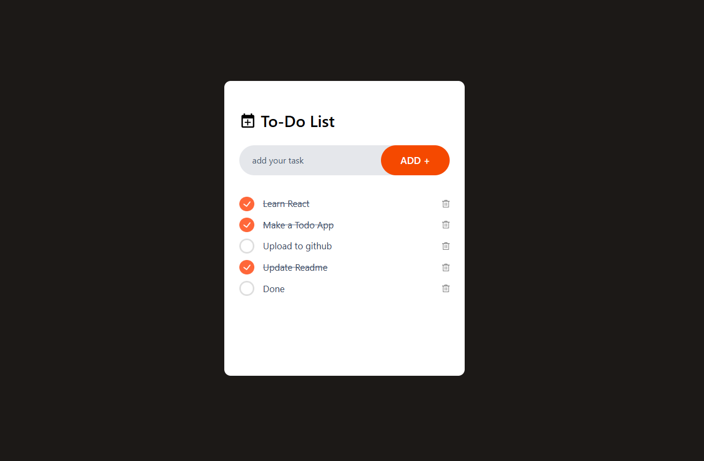
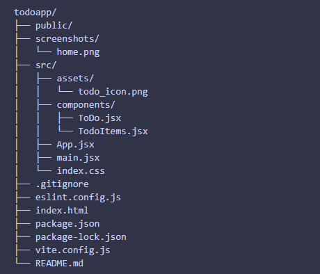

# ✅ React Todo App (with Local Storage)

A **simple, clean, and efficient Todo Application** built using **React + Vite**.
This app helps users manage daily tasks by allowing them to **add, delete, and mark todos as completed**, with data **persisted using browser Local Storage** — so tasks are not lost on page refresh.

---

## ✨ Features

✔️ Add new todos
✔️ Delete existing todos
✔️ Mark todos as **completed / uncompleted**
✔️ Todos are **saved in browser Local Storage**
✔️ Data persists even after page refresh
✔️ Clean & minimal UI
✔️ Built using modern React Hooks

---

## 🖼️ Screenshot

<p align="center">
  
</p>

---

## 🛠️ Tech Stack

* **React** – UI Library
* **Vite** – Fast development & build tool
* **JavaScript (ES6+)**
* **CSS / Tailwind CSS** – Styling
* **Local Storage** – Data persistence

---

## 📁 Project Structure

<p>
  
</p>
---

## 🚀 Getting Started

Follow these steps to run the project locally:

### 1️⃣ Clone the Repository

[https://github.com/23yuvi23/TodoReact-Tailwind.git](https://github.com/23yuvi23/TodoReact-Tailwind.git)

---

### 2️⃣ Install Dependencies

npm install

---

### 3️⃣ Start Development Server

npm run dev

The app will run on:

[http://localhost:5173](http://localhost:5173)

---

## ⚙️ How It Works

1. User enters a task in the input field
2. Todo is added to React state
3. Todos are stored in **Local Storage** using `useEffect`
4. On page reload, todos are fetched from Local Storage
5. User can:

   * Mark todos as complete
   * Delete todos

---

## 💾 Local Storage Implementation

This app uses **browser Local Storage** to persist todos.

Initial state is loaded from Local Storage, and every update to the todo list is automatically saved back to Local Storage using React’s `useEffect` hook.
This ensures todos are **not lost on refresh or reload**.


---

### ✅ Initial State (Load Todos from Local Storage)

```js
const [todoList, setTodoList] = useState(
  localStorage.getItem("todos")
    ? JSON.parse(localStorage.getItem("todos"))
    : []
);
```

**What this does:**

* Checks if `todos` already exist in the browser’s Local Storage
* If they exist, it loads them into the React state
* If not, it initializes the state with an empty array

This ensures todos are **not lost when the page refreshes**.

---

### ✅ Save Todos to Local Storage

```js
useEffect(() => {
  localStorage.setItem("todos", JSON.stringify(todoList));
}, [todoList]);
```

**What this does:**

* Runs every time the `todoList` state changes
* Saves the updated todo list to Local Storage

This keeps the data **persistent across page reloads**.

---

### 🧠 Short Explanation

> The application uses browser Local Storage to persist todo data.
> On initial load, todos are retrieved from Local Storage and stored in React state.
> Whenever the todo list changes, it is automatically saved back to Local Storage using the `useEffect` hook.

---


## 🙌 Author

Made with ❤️ by **23yuvi23**

⭐ If you like this project, don’t forget to **star the repository**!

---
